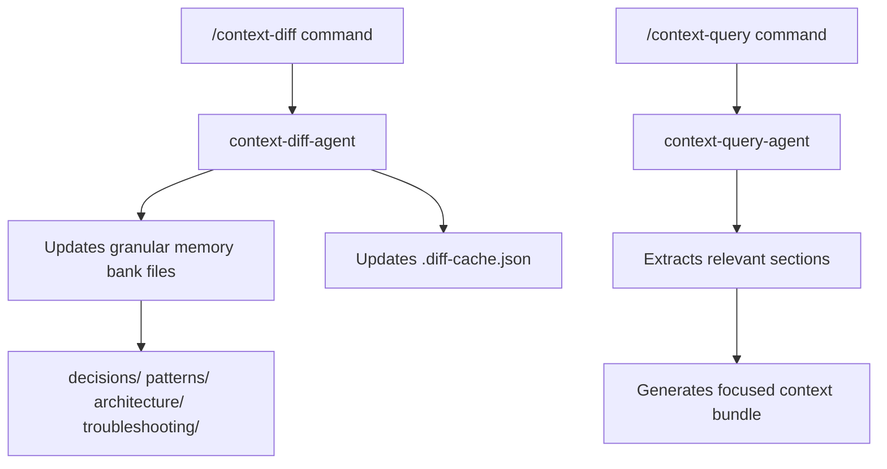

# Workflow: Daily Dev Delta Sync

**Intent:** Keep the **granular memory bank** aligned with the latest code **without scanning the whole repo**.  
**Primary Benefit:** Token-lean, fast refresh of only what changed.

## Visual Workflow

## Triggers
- Starting your dev day
- After pushing a small set of commits
- Before opening a PR

## Preconditions
- Repo has commits beyond the last context diff
- `.claude/memory_bank/.diff-cache.json` exists (created on first run)

## Steps
1) **Compute delta & update only changed areas**
   - Run: `/context-diff`
   - Optional: `/context-diff --since=origin/main` for branch rebases
   - Optional: `/context-diff --paths="src/service/auth/**,packages/web/**"`

2) **Fetch JIT context for the area you’re editing (optional)**
   - Run: `/context-query src/<module>/** --include=decisions,patterns,architecture,troubleshooting --limit=10`

3) **Proceed with coding / PR authoring** using the returned bundle or inline slice.

## Fallbacks
- If diff cache missing: rerun `/context-diff --since=origin/main` to establish a baseline.
- If bundle feels noisy: add a narrower `--paths` and lower `--limit`.

## Success Criteria
- Only impacted granular files updated
- A small, relevant context bundle is returned (or readily produced)
- No archive files changed
