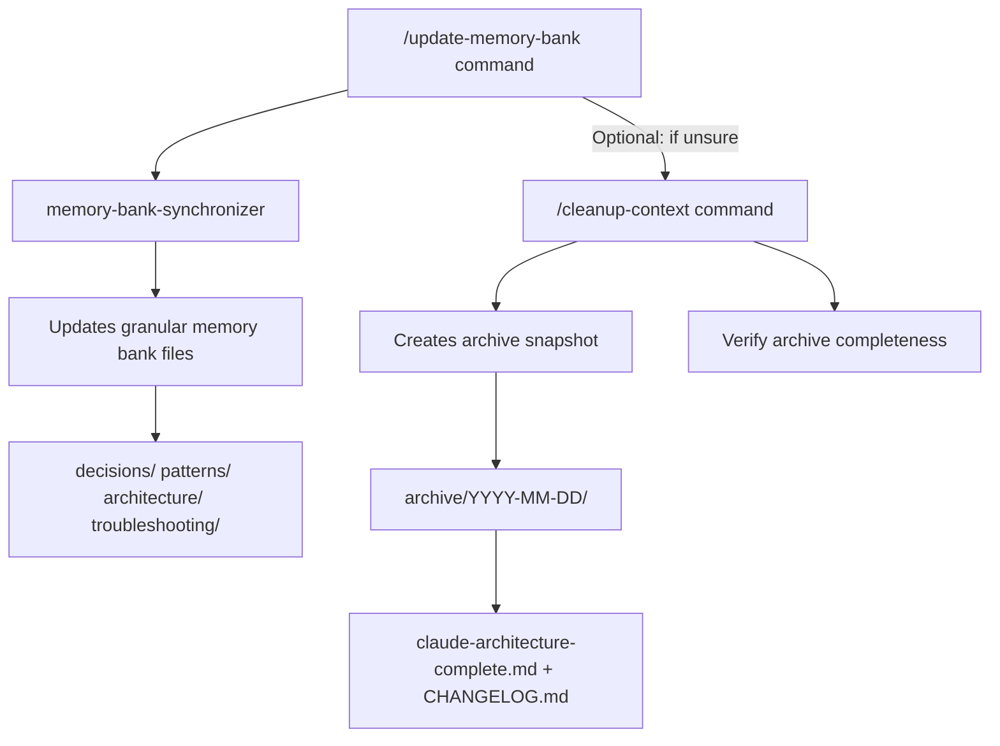

# Workflow: Feature Wrap → Archive Snapshot

**Intent:** Create a **read-only, historical snapshot** of the memory bank at the end of a feature.  
**Primary Benefit:** Preserve history without touching the granular bank used day-to-day.

## Visual Workflow

## Triggers
- Closing a milestone / merging a big feature
- Before long-lived refactors

## Preconditions
- Granular memory bank reflects the latest feature state
  - (If unsure, run `/update-memory-bank` first)

## Steps
1) **Archive snapshot (read-only destination)**
   - Run: `/cleanup-context`
   - Outcome:
     - Creates `.claude/memory_bank/archive/YYYY-MM-DD/`
     - Saves `claude-architecture-complete.md` + `CHANGELOG.md`

2) **Verify archive**
   - Review archive files for completeness and the changelog for source mapping

## Fallbacks
- If snapshot missed content, run `/update-memory-bank` then re-run `/cleanup-context`

## Success Criteria
- Dated archive folder exists with snapshot and changelog
- Granular files remain intact (no deletions/edits)
