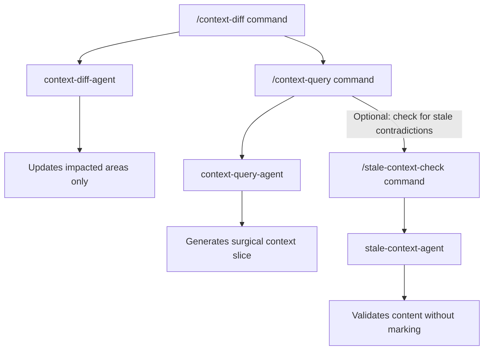

# Workflow: Hotfix / Incident Rapid Context

**Intent:** Deliver the smallest, most relevant context during an incident or hotfix window.  
**Primary Benefit:** Fast triage without loading the entire memory bank.

## Visual Workflow

## Triggers
- Production incident
- Security fix / urgent rollback

## Preconditions
- You know the impacted paths or service

## Steps
1) **Diff only the impacted areas**
   - Run: `/context-diff --paths="services/api/**,infra/**"`

2) **Request a surgical context slice**
   - Run: `/context-query "services/api/**" --include=decisions,patterns --limit=6 --format=inline`

3) **(Optional) Check for stale contradictions**
   - Run: `/stale-check --paths="services/api/**" --no-mark`

4) **Execute fix**
   - Use the inline slice in your prompt or commit message as rationale

## Fallbacks
- If context feels incomplete, widen scope incrementally (add one folder at a time)
- If too verbose, lower `--limit` or drop `architecture` from `--include`

## Success Criteria
- Minimal but sufficient context delivered within seconds
- Changes informed by the correct decision/pattern rationale
