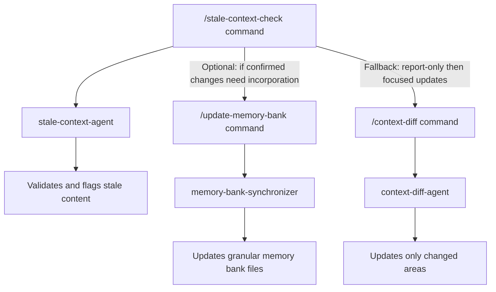

# Workflow: Weekly Hygiene (Stale Context & Usage)

**Intent:** Keep the bank fresh and watch costs.  
**Primary Benefit:** Avoid wasting tokens on outdated or contradictory guidance.

## Visual Workflow

## Triggers
- End of week
- Before a release cut

## Preconditions
- Recent code churn or several merged PRs

## Steps
1) **Detect stale/contradictory context**
   - Run: `/stale-check`
   - Optional: `/stale-check --paths="packages/**" --since=origin/main`

2) **(Optional) Cost/usage snapshot**
   - If you use it: `/ccusage-daily` (or your local equivalent)

3) **Granular refresh if needed**
   - Run: `/update-memory-bank` to incorporate confirmed changes

## Fallbacks
- If there’s a lot of flagged content, convert to report-only first: `/stale-check --no-mark`
- Then schedule focused follow-ups using `/context-diff --paths="<areas>"`

## Success Criteria
- Stale sections are annotated or reported
- Granular files reflect the repo state
- Token usage trends are visible
