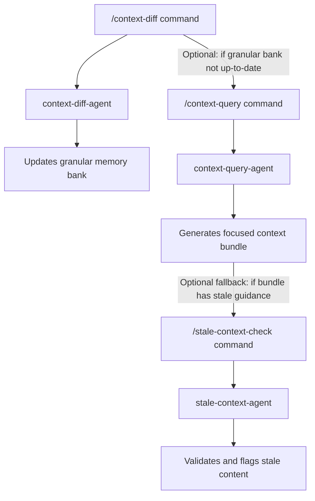

# Workflow: PR Authoring with JIT Context

**Intent:** Generate the minimal set of decisions/patterns/architecture notes needed to **review or author** a PR.  
**Primary Benefit:** Extremely small context windows for reviews and change descriptions.

## Visual Workflow

## Triggers
- Opening a PR
- Requesting review context for a specific module

## Preconditions
- Granular memory bank is up-to-date (if not, run `/context-diff` first)

## Steps
1) **Produce a scoped context bundle**
   - Run: `/context-query "<path-or-feature>" --include=decisions,architecture --limit=8 --format=bundle`
   - Attach or paste bundle into PR description as needed

2) **(Optional) Tighten further**
   - Restrict to a subpath: `/context-query src/payments/** --limit=5`

## Fallbacks
- If the bundle references stale guidance, run `/stale-check --paths="src/payments/**" --no-mark` and refresh

## Success Criteria
- Bundle fits within a small token budget
- Reviewers have just what they need (no noise)
