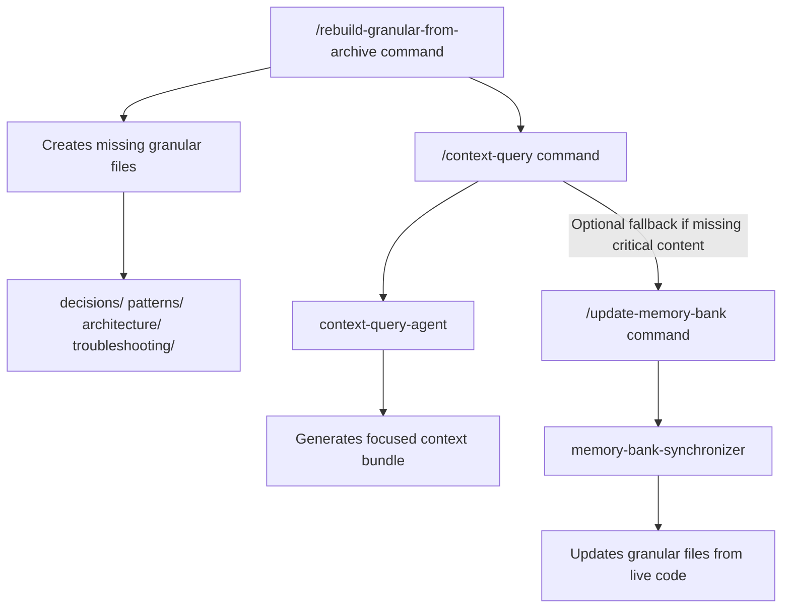

# Workflow: Start New Feature → Rehydrate Granular

**Intent:** Recreate **missing** granular pages from the latest archive so day-to-day context stays **laser-focused**.  
**Primary Benefit:** Small, high-signal files instead of relying on the big archive doc.

## Visual Workflow

## Triggers
- Starting a new feature after an archive snapshot
- Discovering gaps in `decisions/`, `patterns/`, or `architecture/`

## Preconditions
- Latest archive exists under `.claude/memory_bank/archive/YYYY-MM-DD/`

## Steps
1) **Seed missing granular files from archive**
   - Run: `/rebuild-granular-from-archive --strategy=summarize`
   - Optional:
     - `--archive-date=YYYY-MM-DD` (choose a specific snapshot)
     - `--paths="decisions/**,patterns/**"`
     - `--limit-sections=20 --max-chars-per-file=6000`

2) **Tighten JIT authoring scope**
   - Run: `/context-query "<feature or path>" --include=decisions,patterns --limit=10`

3) **Iterate** and keep granular concise; link back to archive for deep history.

## Fallbacks
- If too much content seeded, increase summarization and lower limits
- If something critical is missing, run `/update-memory-bank` to regenerate from live code

## Success Criteria
- Missing granular pages created with concise content and provenance
- Archive remains read-only
- JIT queries produce small, precise bundles
